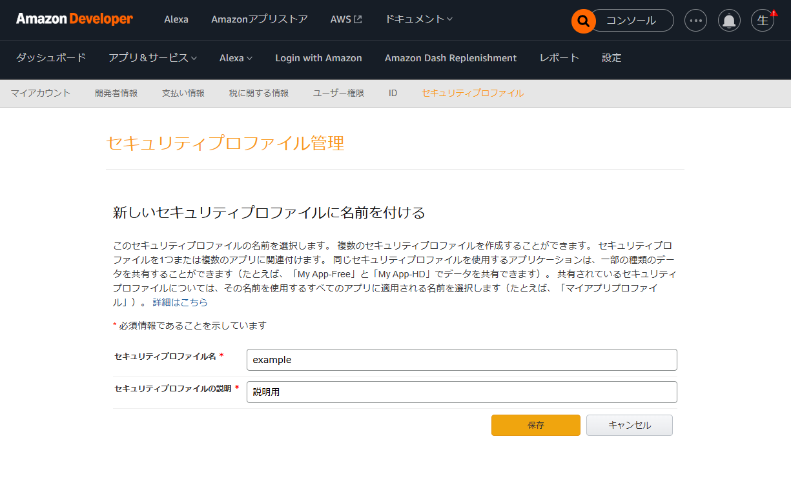

# 各種IDの取得方法

## AMZ_LWA_CLIENT_ID, AMZ_LWA_CLIENT_SECRET

これらはAmazon AdsのAPI登録をすると取得できる
具体的には、**Amazon Developer**の「セキュリティプロファイル」で「セキュリティプロファイルの新規作成」によって作成する。



.png)

## AMZ_LWA_REFRESH_TOKEN

### AMZ_LWA_REDIRECT_URI(リダイレクトURLの設定)

まず、セキュリティプロファイルの「ウェブ設定」を行う

.png)
.png)

ここで「許可された返信URL」というのが`src/print-auth-url.js`で言う「リダイレクト先URL(AMZ_LWA_REDIRECT_URI)」と一致している必要がある。

本来このURLは実在しないURLでも構わないが、その場合リダイレクトは実行されない。

### 許可コードの取得

`src/print-auth-url.js`を実行すると、「許可コード」を発行できるURLが生成される。

最終的に、AMZ_LWA_REDIRECT_URLのURLにリダイレクトされる。
この場合、実在しないURLであればリダイレクトされないが、ブラウザのアドレスバーに表示されたURLの中に`code=`で表示されている文字列が「許可コード」である。

### 認可コードからAMZ_LWA_REFRESH_TOKENを生成

「許可コードを使い」

```
curl -sS -X POST "https://api.amazon.com/auth/o2/token" \
  -H "Content-Type: application/x-www-form-urlencoded;charset=UTF-8" \
  --data "grant_type=authorization_code" \
  --data "code=<許可コード>" \
  --data "client_id=<AMZ_LWA_CLIENT_ID> \
  --data "client_secret=<AMZ_LWA_CLIENT_SECRET>" \
  --data "redirect_uri=<AMZ_LWA_REDIRECT_URI>"
```
を実行する。

成功すると、

```
{
    "access_token":"Atza|eMmQKgV1lOUv2OOIiBt5jQJCQ6KArSdNtlslQFNh3WcCkOoX9hYoaiZEdLDe9JX2DsVR0Ub7fDkICxUUH1WI9PrZRouTnsSBe0PIkA_XzVuDxH7vYRwMBxRg7yI",
    "refresh_token":"Atzr|xUQYRRaRwegWHBKvIKOaoQcOhN0M_-bevW0lA0XauPwQB_aOhyk6ejpH0jVr0-BiL3pVZ6Z5wWUUzSWQw5ZuPIB1h-iIeB-hEedbvOU4wA8_I8pLDsGI9mzm9ycX0-n49jZfo2n9OJWPCwM-4Ce2EmoYqjXiiEl3TOKG2FNnL_QvpRTWovBSAXXX4AKL53UgkuOhl5GDuQ",
    "token_type":"bearer",
    "expires_in":3593
}
```

というようなJSONが返る。
ここにある`"refresh_token"`が`AMZ_LWA_REFRESH_TOKEN`に与えるべき値である。

## AMZ_ADS_PROFILE_ID, AMZ_ADS_API_BASE

以上が取得できれば、`src/get-profile-id.js`を実行することができる。

これを実行すると、

```
$ node src/get-profile-id.js
AMZ_ADS_API_BASE=https://advertising-api-fe.amazon.com
AMZ_ADS_PROFILE_ID=1539272046698250
```

のようになり取得できる。

